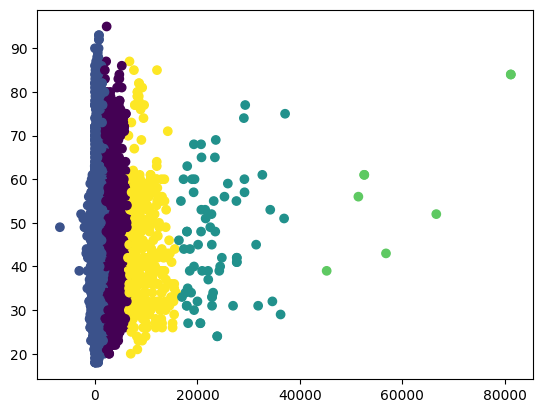

# Case Study
## The Implementation of Competency in Company.
#### ID/X Partners - Data Science

<br>

## Outline
- Clustering (Customer segmentation)
- Charts and Tables
- Insight Extraction

<br>

> Dataset can be downloaded [here.](https://www.kaggle.com/datasets/janiobachmann/bank-marketing-dataset)

<br>
<hr>

## Clustering

### Problem Statement

- <b>The problem</b>: A bank wants to segment its customers into different groups based on their spending habits and demographics. This will help the bank to target marketing campaigns more effectively and to understand how to better serve its customers
- <b>Idea</b>: The bank can use clustering algorithms to group customers together based on their similarities. The clustering algorithm will identify the features that are most important for differentiating between customers, such as the amount of money they spend, the types of products they buy, and their age and location.
- <b>Assignment</b>: Please help implementing a clustering algorithm to segment the bank's customers. need to choose the right clustering algorithm for the data, tune the hyperparameters of the algorithm, and evaluate the results of the clustering.

### Solution

1. Import the necessary libraries.
```python
import numpy as np
import pandas as pd
from sklearn.cluster import KMeans
```

2. Load the customer data.
```python
data = pd.read_csv("customer_data.csv")
```

3. Select the features that you want to use for clustering.
```python
features = ["balance", "age", "campaign"]
```

4. Create the K-Means model.
```python
kmeans = KMeans(n_clusters=5)
```

5. Fit the K-Means model to the data.
```python
kmeans.fit(data[features])
```

6. Predict the cluster labels for each customer.
```python
labels = kmeans.predict(data[features])
```

7. Visualize the clusters.
```python
import matplotlib.pyplot as plt
plt.scatter(data["balance"], data["age"], c=labels)
plt.show()
```
<p align="center">
  
</p>

<br>
<hr>

## Charts and Tables

### Problem Statement

- <b>The problem</b> : A bank wants to understand their customers better so that they can create more effective marketing campaigns. They have a large dataset of customer information, including demographics, financial data, and past marketing interactions.
- <b>Idea</b> : The bank can use charts and tables to visualize the customer data and identify patterns. This can help them to understand how different customer segments behave and what factors influence their purchasing decisions.
- <b>Assignment</b>: Please help creating charts and tables to visualize the customer data. They will need to choose the right charts and tables for the data and to format the data in a way that is easy to understand.

### Solution

1. Import the necessary libraries.
```python
import pandas as pd
import matplotlib.pyplot as plt
```

2. Load the customer data.
```python
data = pd.read_csv("customer_data.csv")
```

3. Create a bar chart of the number of customers in each age group.
```python
plt.bar(data["age"].unique(), data["age"].value_counts())
plt.xlabel("Age")
plt.ylabel("Number of customers")
plt.title("Number of customers in each age group")
plt.show()
```

<p align="center">
  
</p>

4. Create a pie chart of the number of customers who responded to the marketing campaign.
```python
plt.pie(data["previous"].value_counts(), labels=data["previous"].unique(), autopct="%1.1f%%")
plt.title("Percentage of customers who responded to the marketing campaign")
plt.show()
```

<p align="center">
  
</p>

5. Create a scatter plot of the customer's age and balance.
```python
plt.scatter(data["age"], data["balance"])
plt.xlabel("Age")
plt.ylabel("Income")
plt.title("Customer age vs. balance")
plt.show()
```
<p align="center">
  
</p>

<br>
<hr>

## Insight Extraction

### Problem Statement

- <b>The problem</b> : A bank wants to improve their marketing campaigns by understanding the factors that
influence whether or not a customer will subscribe to a term deposit. They have a dataset of past
marketing campaigns, including information about the customers who were contacted, the marketing
materials that were used, and whether or not the customer subscribed to a term deposit.
- <b>Idea</b> : The bank can use insight extraction techniques to identify the factors that are most strongly
correlated with customer subscription. This can help them to create more effective marketing campaigns
that target the right customers with the right messages.
- <b>Assignment</b>: Please help using insight extraction techniques to identify the factors that are most
strongly correlated with customer subscription. They will need to choose the right techniques for the
data and to interpret the results of the analysis.

### Solution

1. Import the necessary libraries.
```python
import pandas as pd
import numpy as np
```

2. Load the customer data.
```python
data = pd.read_csv("customer_data.csv")
```

3. Calculate the correlation coefficient between each pair of features.
```python
correlation = data[['age','balance','day','duration','campaign','pdays','previous']].corr()
```

4. Identify the features with the strongest correlation with customer subscription.
```python
most_correlated_features = correlation[‘previous’].nlargest(5)
```

5. Interpret the results of the analysis.
```python
print("The features that are most strongly correlated with customer subscription are:")
print(most_correlated_features)
```

